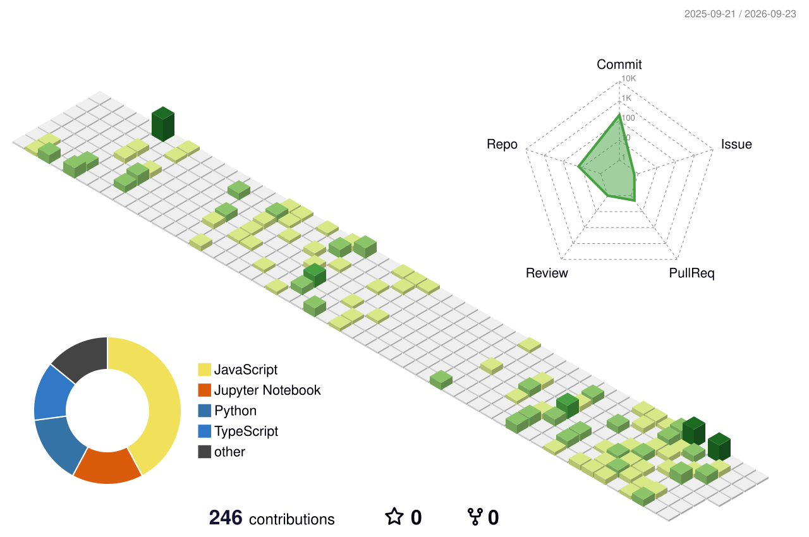

<div align="center">

  <!-- ANIMATED HEADER WAVE -->
  

  <!-- TYPING ANIMATION -->
  <a href="https://git.io/typing-svg">
    
  </a>

  <!-- TAGLINE -->
  <h3>⚡ Engineering production-grade systems from scratch — not just demos.</h3>

  <!-- SOCIAL BADGES -->
  <p>
    <a href="mailto:princekr969@outlook.com"></a>&nbsp;
    <a href="https://linkedin.com/in/princekr969" target="_blank"></a>&nbsp;
    <a href="https://github.com/princekr969" target="_blank"></a>&nbsp;
    <a href="https://portfolio-prince-rajs-projects-7e326db3.vercel.app/" target="_blank"></a>
  </p>

  <!-- DYNAMIC BADGES -->
  <p>
    &nbsp;
    &nbsp;
    
  </p>

</div>

---

## 💫 About Me

```ts
class Prince extends Engineer {
  readonly name    = "Prince Raj";
  readonly role    = "Full-Stack Engineer · Systems Builder";
  readonly edu     = "B.Tech CSE @ ABV-IIITM Gwalior · 2023–2027";
  readonly focus   = ["Agentic AI", "Distributed Systems", "Realtime Infra"];

  currentlyBuilding(): string {
    return "Roleneo — 15-node LangGraph career transition engine with GraphRAG";
  }

  mantra(): string {
    return "If it isn't observable, it isn't shipped.";
  }
}
```

- 🔭 **Currently building** — LangGraph + Neo4j GraphRAG pipelines for career transition intelligence
- 🌱 **Deep diving into** — Go service design, CRDT-based realtime systems, and LLM observability
- 💬 **Ask me about** — System design, distributed systems, DSA, or shipping a project from idea to production
- ⚡ **Fun fact** — I added observability (Prometheus + Grafana) to a college fest platform. Catching a 500 in prod > catching it locally.
- 🎯 **Looking for** — **SDE / New Grad roles starting 2027** · Winter internships 2026

---

## 🛠️ Tech Stack & Tools

<p align="center">
  <a href="#"></a><br>
  <a href="#"></a><br>
  <a href="#"></a><br>
  <a href="#"></a>
</p>

---

## 📊 GitHub Analytics

<p align="center">
  
  
</p>

<p align="center">
  
</p>

<p align="center">
  
</p>

---

## 💼 Experience

<table>
  <tr>
    <td width="8%" align="center"></td>
    <td>
      <b>Software Developer — Summer Colloquium</b><br/>
      <i>SLDC Odisha Project · ABV-IIITM Gwalior &nbsp;|&nbsp; May 2026 – Aug 2026</i>
      <ul>
        <li>Architected a <b>centralized API abstraction layer</b> decoupling data-fetching from UI across <b>10+ modules</b></li>
        <li>Replaced fixed report downloads with <b>flexible custom date-range</b> selection for arbitrary range generation</li>
        <li>Built a <b>Node.js/TypeScript integration layer</b> consuming real-time <b>SCADA APIs</b> across 5 grid zones</li>
        <li>Designed a <b>dual-source data pipeline</b> (SCADA + Open-Meteo) with Drizzle ORM → Hour-Ahead Load Forecasting</li>
      </ul>
      <p>
        
        
        
        
      </p>
    </td>
  </tr>
  <tr><td colspan="2"><hr/></td></tr>
  <tr>
    <td width="8%" align="center"></td>
    <td>
      <b>Tech Lead</b><br/>
      <i>Sangillence (Startup) &nbsp;|&nbsp; Oct 2025 – Mar 2026</i>
      <ul>
        <li>Built a <b>full-stack platform</b> for the Sangillence Open Book Olympiad, handling end-to-end delivery for <b>500+ students</b> across Class 3–10 with live photo capture and on-site identity verification for tamper-proof registration</li>
        <li>Designed and implemented <b>student registration, authentication, and examination workflows</b></li>
        <li>Shipped a responsive, production-ready product independently for a real client, from initial design to deployment within <b>14 weeks</b></li>
      </ul>
      <p>
        
        
        
        
        
        
        
      </p>
    </td>
  </tr>
</table>

---

## 🚀 What I've Shipped

<table>
  <tr>
    <td width="50%" valign="top">
      <h3 align="center">
        <a href="https://github.com/princekr969/Roleneo" target="_blank">
          
        </a>
      </h3>
      <p align="center">
        <a href="https://github.com/princekr969/Roleneo" target="_blank">
          
        </a>
      </p>
      <p align="center"><i>Intelligent Career Transition Engine — Agentic AI & GraphRAG</i></p>
      <p align="center">
        
        
        
        
      </p>
      <ul>
        <li><b>15-node LangGraph pipeline</b> — Supervisor fan-out activating 6 parallel specialist agents</li>
        <li><b>GraphRAG on Neo4j</b> with O*NET data — hybrid vector + Cypher skill-gap retrieval</li>
        <li>Quality-gated output: Critic scoring ≥7/10 with 2-retry cap via Gemini 2.5</li>
        <li>Live salary, courses, YouTube & community intel fetched per query via Tavily + LangSmith tracing</li>
      </ul>
    </td>
    <td width="50%" valign="top">
      <h3 align="center">
        <a href="https://github.com/princekr969/QueryForge-" target="_blank">
          
        </a>
      </h3>
      <p align="center">
        <a href="https://github.com/princekr969/QueryForge-" target="_blank">
          
        </a>
      </p>
      <p align="center"><i>Parallel SQL Query Engine for Analytical Workloads</i></p>
      <p align="center">
        
        
        
        
      </p>
      <ul>
        <li><b>3 worker nodes</b> via gRPC streaming — MapReduce aggregation + predicate pushdown</li>
        <li><b>1.7× speedup</b> on 2M+ row analytical datasets over single-node baseline</li>
        <li>Fault-tolerant scheduler: 5s heartbeats, 15s dead-node detection, max 3 retries</li>
        <li>Full observability: OpenTelemetry · Prometheus · Grafana across <b>9 containerized services</b></li>
      </ul>
    </td>
  </tr>
  <tr>
    <td width="50%" valign="top">
      <h3 align="center">
        <a href="https://github.com/princekr969/Blog-Generation-using_langgraph" target="_blank">
          
        </a>
      </h3>
      <p align="center">
        <a href="https://github.com/princekr969/Blog-Generation-using_langgraph" target="_blank">
          
        </a>
      </p>
      <p align="center"><i>Multi-Modal Agentic Blog Generator — Voice I/O & Multilingual</i></p>
      <p align="center">
        
        
        
        
      </p>
      <ul>
        <li>State-machine LangGraph pipeline — <b>3 agentic workflows</b> with conditional edge routing</li>
        <li><b>5 languages</b>: English, Hindi, French, Spanish, German with tone & length control</li>
        <li>Voice input via <b>AssemblyAI STT</b> + streamed audio output via <b>ElevenLabs TTS</b></li>
        <li>FastAPI REST backend + Streamlit frontend for end-to-end voice-to-blog delivery</li>
      </ul>
    </td>
    <td width="50%" valign="top">
      <h3 align="center">
        <a href="https://github.com/princekr969/Code-Buddy" target="_blank">
          
        </a>
      </h3>
      <p align="center">
        <a href="https://github.com/princekr969/Code-Buddy" target="_blank">
          
        </a>
      </p>
      <p align="center"><i>Real-Time Collaborative Code Editor</i></p>
      <p align="center">
        
        
        
        
      </p>
      <ul>
        <li><b>Live cursor tracking</b> via Yjs CRDT + Socket.IO</li>
        <li><b>Monaco Editor</b> with multi-file tabs + syntax highlighting</li>
        <li>In-browser execution across <b>25+ languages</b></li>
        <li>JWT auth · MongoDB persistence · in-editor chat</li>
      </ul>
    </td>
  </tr>
</table>

---

## 🏆 Achievements & Leadership

- **Design Lead**, Inter-IIITM Sports Meet & Aurora -- Led visual design for two major college fests, producing **20+ posters and digital creatives**
- Built **4 production-grade systems** independently from system design to deployment
- Strong foundation in **DSA, OOP, DBMS, OS, Computer Networks, Software Engineering, Compiler Design, and System Design**

---

## 🤝 Let's Connect

<p align="center">
  <a href="mailto:princekr969@outlook.com">
    
  </a>
</p>

<p align="center">
  <i>I'm always open to discussing systems design, distributed architectures, or potential opportunities.</i><br>
  <b>Looking for New Grad / SDE roles for 2027</b>
</p>

---

## 🌌 Interactive 3D Contribution Graph

<p align="center">
  
</p>

---

## 🐍 GitHub Contribution Snake

<p align="center">
  <picture>
    <source media="(prefers-color-scheme: dark)"
      srcset="https://raw.githubusercontent.com/princekr969/princekr969/output/github-contribution-grid-snake-dark.svg">
    <source media="(prefers-color-scheme: light)"
      srcset="https://raw.githubusercontent.com/princekr969/princekr969/output/github-contribution-grid-snake.svg">
    
  </picture>
</p>

---

## 💬 Random Dev Quote

<p align="center">
  
</p>

---

<div align="center">

  <!-- ANIMATED FOOTER WAVE -->
  

  ### ⚡ *"If it isn't observable, it isn't shipped."*

  <sub>⭐ Star my repos if they helped you · Built with ❤️ in Gwalior</sub>

</div>
